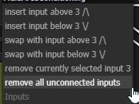
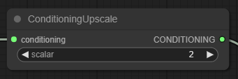
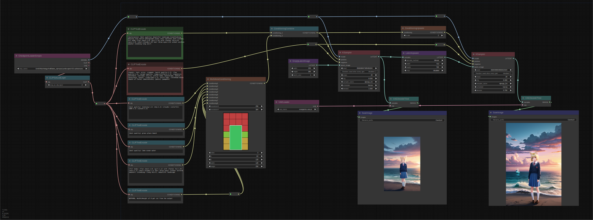
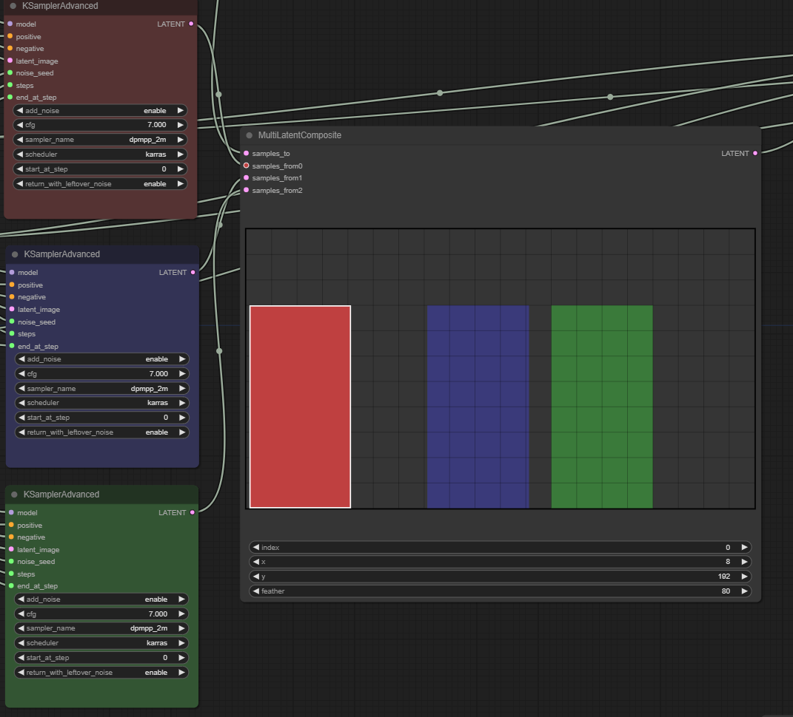

# Davemane42's Custom Node for [ComfyUI](https://github.com/comfyanonymous/ComfyUI)  

## Instalation:

- Navigate to the `/ComfyUI/custom_nodes/` folder
- `git clone git clone https://github.com/Davemane42/ComfyUI_Dave_CustomNode`
- Start ComfyUI
  - all require file should be downloaded/copied from there.
  - no need to manually copy/paste .js files anymore

___
# MultiAreaConditioning 2.4  

Let you visualize the ConditioningSetArea node for better control  

    
Right click menu to add/remove/swap layers:

    

Display what node is associated with current input selected  

this also come with a <strong>ConditioningUpscale</strong> node.  
useseful for hires fix workflow

    
Result example:

    

    
Workflow example:

    

  
___
# MultiLatentComposite 1.1  

Let you visualize the MultiLatentComposite node for better control  

    
Right click menu to add/remove/swap layers:

    

Display what node is associated with current input selected  

    
Result example:

    

    
Workflow example:

    

___
# Known issues

## MultiAreaComposition 2.4
- 
## MultiLatentComposite 1.1
- no check for out of bound layers